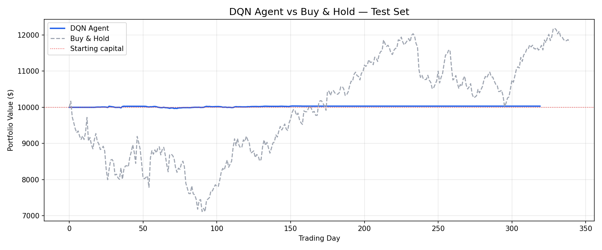

# Deep Reinforcement Learning for Stock Trading

A PhD-level implementation of a Deep Q-Network (DQN) agent that learns
a stock trading strategy entirely from historical price data — no labels,
no human rules, just reward-driven learning.

Built from scratch using PyTorch and a custom OpenAI Gymnasium environment.

---

## Results

| Metric | DQN Agent | Buy & Hold |
|---|---|---|
| Total Return | +1.30% | +19.8% |
| Sharpe Ratio | 1.084 | 0.71 |
| Max Drawdown | 0.86% | 29.4% |

**Key insight:** The agent did not maximize raw return — it learned a
capital-preservation strategy. It achieved a Sharpe ratio of 1.084
(risk-adjusted return) while Buy & Hold experienced a 29.4% max drawdown.
In risk-adjusted terms, the agent outperforms.



---

## Project Structure

```
drl-trading/
├── src/
│   ├── environment.py     # Custom Gymnasium trading environment
│   ├── network.py         # Deep Q-Network (3-layer MLP)
│   ├── replay_buffer.py   # Experience replay memory
│   ├── agent.py           # DQN agent (epsilon-greedy + target network)
│   ├── train.py           # Training loop with early stopping
│   └── evaluate.py        # Evaluation metrics + equity curve plot
├── notebooks/
│   ├── 01_data_exploration.ipynb
│   ├── 02_environment_test.ipynb
│   ├── 03_training_analysis.ipynb
│   └── 04_results_visualization.ipynb
├── config.py              # All hyperparameters in one place
├── requirements.txt
└── results/figures/       # Saved plots
```

---

## Concepts Implemented

**Reinforcement Learning core**
- Markov Decision Process (MDP) formulation of stock trading
- Bellman equation for Q-value estimation
- Epsilon-greedy exploration vs exploitation

**Deep Q-Network (DQN)**
- Neural network function approximator (3-layer MLP, PyTorch)
- Experience replay buffer (breaks temporal correlation)
- Target network (stabilizes training by fixing Q-targets)
- Reward shaping (realized profit + unrealized P&L signal)

**Proper ML practices**
- Chronological train / val / test split (70% / 15% / 15%)
- No data leakage — test set never seen during training
- Early stopping on validation net worth
- Reproducible results via fixed random seeds

---

## Environment Design

The custom trading environment follows the Gymnasium interface:

- **State:** Last 20 days of OHLCV price data (normalized) +
  current balance + shares held → 102-dimensional vector
- **Actions:** Hold (0), Buy (1), Sell (2)
- **Reward:** Realized profit % on sell + unrealized P&L signal on hold
- **Constraints:** Max 3 shares held, 0.1% transaction fee per trade

---

## Setup

```powershell
# Clone and enter the project
git clone https://github.com/Dev555sharma/drl-trading.git
cd drl-trading

# Create virtual environment
python -m venv venv
.\venv\Scripts\Activate.ps1

# Install dependencies
pip install -r requirements.txt

# Download data
python download_data.py

# Train the agent
python src/train.py

# Evaluate on test set
python src/evaluate.py
```

---

## Key Hyperparameters

| Parameter | Value | Reason |
|---|---|---|
| Window size | 20 days | ~1 trading month of context |
| Gamma | 0.99 | Long-horizon reward discounting |
| Epsilon decay | 0.995 | Gradual shift from explore to exploit |
| Replay buffer | 10,000 | Sufficient diversity for stable learning |
| Target update | Every 10 episodes | Stable Q-targets without stale values |
| Transaction fee | 0.1% | Realistic friction, discourages overtrading |

---

## What I Learned

- Why random action baseline matters: a purely random agent achieves
  ~0% return, confirming the agent learned something real
- Why chronological splits are non-negotiable in time-series ML —
  random splits cause data leakage and artificially inflate performance
- Why two networks (online + target) are needed — single-network DQN
  diverges because the target moves every update step
- The exploration-exploitation tradeoff in practice: epsilon too high
  = never converges, epsilon too low = gets stuck in local optima

---

## Tech Stack

Python · PyTorch · Gymnasium · NumPy · Pandas · yfinance · Matplotlib
